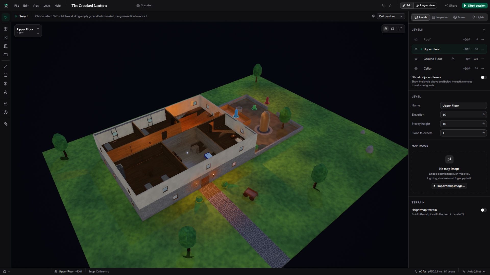
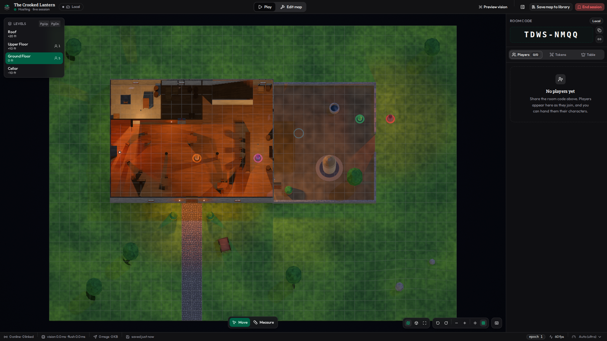
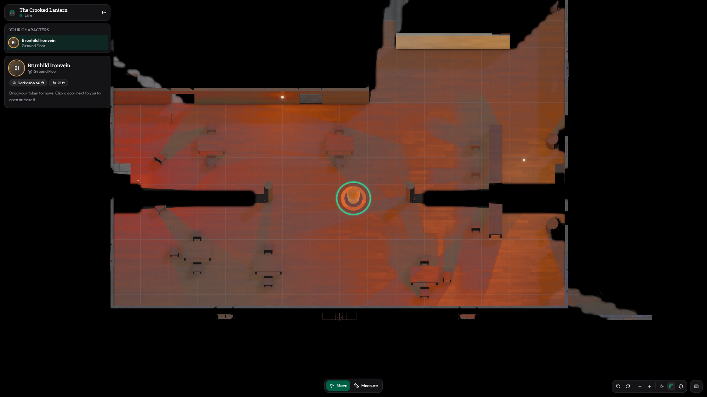
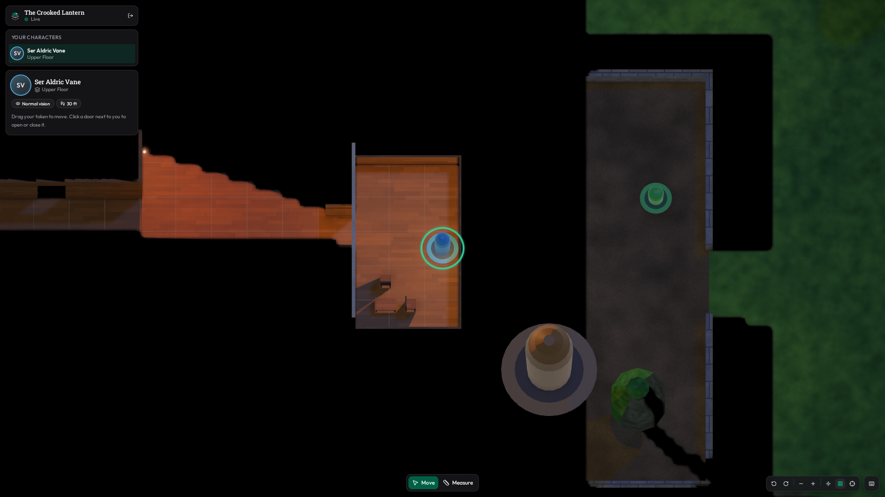
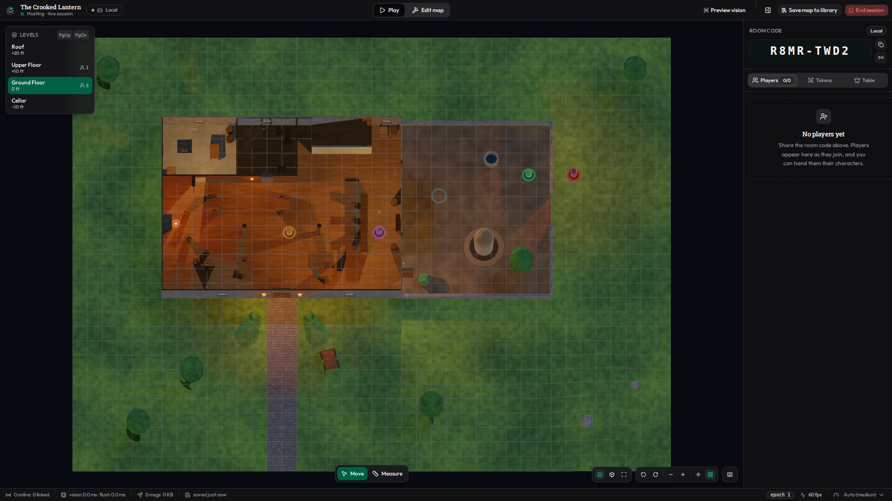

# Atlas VTT

Atlas is a virtual tabletop that runs in the browser. The DM builds maps as real 3D scenes made of stacked
levels (cellar, ground floor, upper floor, roof…). Players explore them in a 2.5D top-down view, where
lighting, shadows, line of sight and fog of war all come from that 3D geometry. The DM's browser tab is the
authoritative game server, and each player receives only what their own tokens can perceive.



| DM console (top-down, everything visible) | A player's view (fog of war, darkvision) |
|---|---|
|  |  |
| **A player on the balcony looking down into the courtyard** | **Same scene on the medium tier (integrated GPUs)** |
|  |  |

All screenshots show the bundled *The Crooked Lantern* sample at 1920×1080. They were captured by
`e2e/showcase.mjs`, and more are in [`docs/screenshots/`](docs/screenshots/).

## Features

**Scene editor (DM)**
- Multi-level scenes: each level has its own elevation, storey height and floor thickness. Levels can be
  shown or hidden one by one, and the levels above and below the active one can be drawn as ghosts.
- Grid building on 5 ft squares, with snapping to cell centres, vertices, half cells or wall endpoints, and
  free placement with Alt.
- Tools for floors, walls (height and thickness), doors (open / closed / locked / secret, several styles),
  windows, stairs, ramps and ladders between levels, pillars, props from a primitive library (tables,
  crates, barrels, trees…), tokens, and a heightmap brush for terrain.
- Lights you can place anywhere in 3D (torches, lanterns, braziers, magical light), each with a colour, a
  bright and a dim radius, flicker, and an on/off state, plus sunlight or moonlight presets.
- Battlemap import: drop one image per storey (for example Forgotten Adventures maps, 100+ MP images
  included). Atlas calibrates it to the grid, draws it under the lighting, and can trace a floor from the
  image's transparency and walls from its outline.
- Undo / redo, copy / cut / paste / duplicate, multi-select and box select, move, rotate and nudge.
  Ctrl+V pastes at the pointer, snapped like a drag; Ctrl+Alt+V pastes without snapping.
- A free 3D orbit camera, a top view, and a player-view preview through any token's eyes.
- Scenes are saved as versioned JSON with a version history. You can export and import `.atlas.json` files
  (map images embedded) and share read-only links.

**Lighting and vision**
- Real-time shadows from every light, cast by walls, pillars, props, terrain and the floors of other
  levels. Each point light has a cached octahedral distance map in a shared atlas, so there is one custom
  shader pass and no recompiles.
- Line of sight per token, computed in 3D from its eye height: a low wall blocks a halfling's view but not
  a giant's, and a character on a balcony sees down into the courtyard.
- Vision types: normal, darkvision (with range, rendered in greyscale), blindsight, and blind.
- Fog of war with three states: currently visible, explored (dimmed, static geometry only, no tokens), and
  unexplored (black). Players can share vision with the party (a toggle).
- The DM sees everything and can preview any token's vision.

**Play**
- An orthographic or slightly tilted top-down camera with automatic cutaway: anything above the token's
  level (on the upper part of a staircase, the level it leads to) is hidden.
- Drag a token to move it along an A* path, with a ruler in feet that follows the grid's diagonal rule.
  To climb stairs or a ramp, drag the token past the top step, or use the **Go up** / **Go down** buttons
  on the top step and the landing; ladders offer climb up / down.
- Click a door next to your token to open or close it. There is also a standalone measure tool.
- Free assets: when starting a game, the DM chooses which libraries of free assets it loads (one
  category so far, **Token models**: 3D miniatures). The host console's **Assets** tab lists them and puts
  a model on the selected token; the token inspector and each token's menu offer them too. A model stands
  on the token's base for everyone who sees the token, at a level of detail that fits its size on screen.
- DM controls: lock movement (for everyone or per player), shared vision, speed enforcement, door and light
  toggles, hide or reveal tokens, reveal secret doors, assign tokens to players, reset fog, and kick
  players. The DM can switch to "Edit map" mid-session, and players see the edits live. Those edits stay
  in the session until the DM chooses **Save map to library**, which saves them (with the current token,
  door and light state) as a new version of the library scene, after a conflict check.

**Multiplayer**
- The DM hosts a session and players join with an 8-character room code. No accounts are needed: the app
  signs everyone in as an anonymous guest. A guest can create a permanent account with Discord (from the
  name chip in the header) to keep their scenes and games across browsers; the display name stays
  Atlas's own and can be changed at any time.
- The DM is authoritative. Players send move and door requests; the DM's tab validates them, computes
  visibility in a Web Worker, and sends each player a per-player diff of their filtered view.
- Players never receive data they cannot see. Hidden tokens, the lights attached to them, secret doors, DM
  notes, unexplored geometry, DM-only fields and whole battlemaps never leave the DM's tab. Players get
  only the map image chunks of cells they have explored, stored per player behind storage row-level
  security (RLS).
- Reconnection: a dropped or reloaded player resyncs from a patch log, a snapshot or their stored view. If
  the DM reloads, the game resumes from the saved state. A second DM device can take over the session, and
  the stale one stands down.
- Security relies on Supabase Postgres RLS, private Realtime channels with per-topic policies, fenced RPCs
  and private Storage buckets.

**Rendering quality**
- Four tiers: low, medium, high and ultra. High and ultra add bloom and a vignette. Ultra adds soft
  shadows from 1024² light tiles, screen-space ambient occlusion, filmic tone mapping and film grain.
- On "Auto" (the default), a short GPU benchmark picks the tier when the editor, the host console or the
  player page opens (cached per GPU), and adaptive quality steps down or up at runtime to hold 60 fps.
  Each of those pages has a quality selector to pick a tier by hand.

## Quick start

Requirements: Node 22 (or 20.19+) and a WebGL2 browser. Chromium-based browsers are the tested target;
Firefox passes a smoke test (`e2e/firefox-smoke.mjs`), and Safari is untested.

```bash
npm install
npm run dev          # http://localhost:5173
```

### Local mode (no backend)

Without Supabase settings the app runs in **local mode**. Scenes are stored in IndexedDB, and games run
between tabs of one browser over `BroadcastChannel`, with each tab acting as its own user. Open the DM in
one tab and the players in others (`/join/<room code>`). Local mode is for development and testing only:
it is not secure. When Supabase is configured you can still force local mode with `?local=1`, and go back
with `?local=0`.

### With Supabase

1. Create a Supabase project and apply the migrations in `supabase/migrations/`, in filename order. You can
   use the Supabase CLI (`supabase init` if needed, then `supabase link --project-ref <ref>` and
   `supabase db push`), or paste each file into the SQL editor. They create the
   tables, RLS policies, RPCs, Realtime policies, the private Storage buckets `scene-assets` and
   `session-tiles`, the public bucket `free-assets` and the free asset catalog (`free_assets`).
   The free asset files themselves are published separately (see "Free assets" below).
2. In the Supabase dashboard:
   - **Authentication → Sign In / Providers → allow anonymous sign-ins** (on). Players and DMs sign in
     anonymously.
   - **Realtime → Settings → "Allow public access"** (off), so that only private channels, which are
     authorised by the Realtime policies, can be joined.
   - **Authentication → Rate Limits → anonymous sign-ins**: keep it low for a public deployment (the
     default is 30 per hour per IP). Scene, version-history, session and asset quotas are enforced per
     account, so this rate limit is what bounds abuse from many anonymous accounts.
   - Permanent accounts (optional): **Authentication → Sign In / Providers → Discord** (on, with the
     client id and secret of a Discord application whose OAuth2 redirect is
     `https://<project-ref>.supabase.co/auth/v1/callback`), **Allow manual linking** (on: a guest becomes
     permanent by linking Discord to the same user), and under **Authentication → URL Configuration** add
     every origin's `/auth/callback` to the redirect URLs (e.g. `http://localhost:5173/**`; the Site URL's
     own host is always allowed). Deploy the `merge-guest` Edge Function (`supabase functions deploy
     merge-guest --no-verify-jwt`) so a guest who signs in to an existing account takes its scenes along.
3. Create `.env.local` next to `package.json` (see `.env.example`):

   ```bash
   VITE_SUPABASE_URL=https://<project-ref>.supabase.co
   VITE_SUPABASE_PUBLISHABLE_KEY=sb_publishable_...
   ```

4. Run `npm run dev`. The header shows **Cloud** instead of **Local**.

### Scripts

| Command | What it does |
|---|---|
| `npm run dev` | Vite dev server |
| `npm run build` | Typecheck (`tsc -b`) and production build into `dist/` |
| `npm run preview` | Serve the production build |
| `npm run typecheck` | Typecheck only (`tsc -b`: the root `tsconfig.json` only references the app and node projects, so a plain `tsc` checks nothing) |
| `npm test` | Unit and integration tests (`vitest run`) |
| `npm run lint` | ESLint |
| `npm run format:check` | List files that differ from the Prettier config (see Conventions) |

Dev-only pages: `/dev/render.html` is the renderer harness. `?mode=player&pipeline=1` renders exactly what
a player is sent; `?models=<url prefix>&modelids=elf-archer,…` puts token models on the sample's tokens.

### Free assets

Free assets are files anyone may use in their games (token models today; maps and audio later), grouped by
category. The catalog is the `free_assets` table and the files live in the public `free-assets` bucket;
clients cannot write either. To publish token models from miniature STL sculpts:

```bash
node scripts/free-assets/build-token-models.mjs --in "<folder of .stl files>" --out <folder>
SUPABASE_URL=https://<project-ref>.supabase.co SUPABASE_SECRET_KEY=sb_secret_... \
  node scripts/free-assets/upload.mjs --dir <folder>
```

The build script (models are listed at its top: file, facing, base cut, scale) orients each figure,
removes a sculpted base, and writes a meshopt-compressed GLB with three levels of detail plus a thumbnail.
The upload script puts the files in the bucket and upserts the catalog rows. A new category also needs
`FREE_ASSET_CATEGORIES` (`src/core/session/freeAssets.ts`), `private.free_asset_categories()` and the
table's category check.

## Architecture

```
src/
  core/        Pure TypeScript, with no DOM, three.js or React; runs in a Worker and in vitest.
               Scene document + zod schema + migrations, grid, geometry, occlusion (single source of
               blocking truth), vision, movement, undo history, and the session (reducer, player filter,
               diffs)
  render/      three.js (WebGL2): one custom world shader (lighting + shadows + perception + fog),
               distance atlases, light scheduling, fog mask textures, cameras, overlays, post-processing
  editor/      Editor state (zustand + immer patches) and tools
  play/        Play-mode controllers (selection, drag-to-move, path planning, measure, doors, ladders)
  net/         Supabase client and repositories, Realtime / BroadcastChannel transports, the DM-side host
               runner (+ vision worker), the player client, map-image assets and tiles
  app/, components/, routes/   React + shadcn/ui (Base UI) application shell and pages
supabase/      migrations (schema, RLS, RPCs, Realtime and Storage policies) and SQL tests
e2e/           Playwright end-to-end scripts
```

The host pipeline per player is: request → zod validation → authorisation → reducer → vision worker →
knowledge update (explored cells and memory) → `filterForPlayer` → diff → sequenced patch. Every byte sent
to a player goes through `src/core/session/filter.ts`.

- [`docs/ARCHITECTURE.md`](docs/ARCHITECTURE.md): the module contracts (world conventions, blocking rules,
  rendering, simulation, multiplayer protocol, database and RLS, map images, quality tiers), plus an
  **Implementation status** appendix listing known gaps.
- [`docs/PERFORMANCE.md`](docs/PERFORMANCE.md): how the frame budget is met.
- [`docs/SPEC.md`](docs/SPEC.md): the product requirements.

## Performance

Target: 60 fps on a mid-range laptop with ~20 lights and ~15 tokens, while the DM's tab also runs the
simulation. How it gets there:
- One forward pass with lights in uniform arrays, so there are never any recompiles.
- CPU light culling to 32 slots, a per-cell mask so each fragment only visits the lights that reach it,
  and per-fragment early-outs.
- Cached shadow tiles with a per-frame update budget (4 tiles and 2 ms) and a priority queue.
- Instanced occluder proxies instead of the visual meshes.
- A pixel budget instead of the raw device pixel ratio.
- Authoritative vision in a Web Worker with an incremental light field and per-viewer line-of-sight caches.

Measured with `e2e/perf.mjs`: 1920×1080, vsync on, and one renderer on the GPU at a time. "GPU frame" is
the time for frames rendered back to back with a GPU sync, which is the headroom against the 16.7 ms
budget.

| GPU · tier | Scene | DM view: fps · GPU frame median / p95 | Player view: fps · GPU frame median / p95 |
|---|---|---|---|
| AMD Radeon iGPU · medium | The Crooked Lantern (4 levels, 15 lights) | 60 · 11.8 / 12.7 ms | 60 · 7.8 / 8.8 ms |
| AMD Radeon iGPU · medium | Stress Test (20 lights, 15 tokens) | 60 · 7.4 / 8.3 ms | 60 · 7.0 / 8.0 ms |
| AMD Radeon iGPU · medium | The Vineyard (3 battlemaps, 17 lights) | 60 · 6.0 / 6.5 ms | 60 · 9.1 / 10.1 ms |
| NVIDIA RTX · ultra | The Crooked Lantern | 60 · 2.3 / 2.9 ms | 60 · 1.8 / 2.3 ms |
| NVIDIA RTX · ultra | Stress Test | 60 · 2.5 / 3.0 ms | 60 · 1.8 / 2.3 ms |
| NVIDIA RTX · ultra | The Vineyard | 60 · 2.1 / 2.6 ms | 60 · 1.9 / 2.4 ms |

Every view holds a steady 60 fps (the highest of three or four runs is shown). The AMD part is the
small iGPU of a desktop Ryzen 7 9800X3D, below the laptop target's Iris Xe / GTX 1650 class, so it is a
conservative stand-in. The tightest case is the Crooked Lantern DM view on it at medium, at ~76% of the
16.7 ms budget at p95; the Vineyard player view depends on where the token stands and has measured up to
~14.6 ms. The high tier costs ~21–23 ms on that GPU, so on such machines the start-up benchmark and adaptive
quality keep medium. Details are in [`docs/PERFORMANCE.md`](docs/PERFORMANCE.md).

## Testing

```bash
npx vitest run                     # all unit and integration tests; live Supabase tests are skipped
ATLAS_LIVE_SUPABASE=1 npx vitest run src/net/live.supabase.test.ts   # opt-in, uses .env.local
```

The live Supabase tests (`src/net/live.supabase.test.ts`, `src/net/host/live.supabase.test.ts` and
`src/net/assets/live.assets.supabase.test.ts`) create anonymous users that the publishable key cannot
delete. `src/net/guestMerge.live.supabase.test.ts` (needs the deployed `merge-guest` function) merges a
guest into a new email sign-up and prints that permanent user's id for deletion.

**SQL tests** (`supabase/tests/*.sql`: RLS, RPCs, Realtime authorisation, Storage policies, tile chunks,
per-account quotas, free assets).
Run each file as `postgres`, in the SQL editor or with psql. Each file runs in one transaction that is
rolled back, and its final row reports `passed` / `failed`.

**End-to-end scripts** (`e2e/`, plain Node + Playwright). Start a dev server, then run for example:

```bash
npx vite --port 5173 &
ATLAS_URL=http://127.0.0.1:5173 node e2e/editor-smoke.mjs         # quality probe (tier per GPU), menus, labels, options bar at 1280 px, the tools, undo/redo, shortcuts, save, reload
ATLAS_URL=http://127.0.0.1:5173 node e2e/vineyard-build.mjs       # builds test_maps/vineyard.atlas.json from the battlemaps (see below)
ATLAS_URL=http://127.0.0.1:5173 node e2e/multiplayer-local.mjs    # DM + 2 players in local mode: host menus, oracle-equal views, moves, doors, stairs, lock, reloads, leak scan
ATLAS_SCENE=$PWD/test_maps/vineyard.atlas.json ATLAS_URL=http://127.0.0.1:5173 node e2e/multiplayer-local.mjs   # the same on the Vineyard
ATLAS_URL=http://127.0.0.1:5173 node e2e/multiplayer-supabase.mjs # the same against the real backend (+ Realtime / table / Storage RLS checks, no public channels, a kicked member's subscriptions, sub-cell chunk clipping)
ATLAS_URL=http://127.0.0.1:5173 node e2e/multiplayer-latency.mjs  # move results on a 120×120 daylit field arrive well under the 5 s timeout
ATLAS_URL=http://127.0.0.1:5173 node e2e/host-save-map.mjs        # "Save map to library" from a live session, including the conflict path
ATLAS_URL=http://127.0.0.1:5173 node e2e/free-assets.mjs          # start a game with token models, put one on a token, a player downloads and draws it (ATLAS_FREE_ASSETS_DIR serves a local build)
ATLAS_URL=http://127.0.0.1:5173 node e2e/engine-leak.mjs          # editor ↔ library round trips release every WebGL context
ATLAS_URL=http://127.0.0.1:5173 node e2e/perf.mjs                 # frame times per GPU / tier / scene
ATLAS_URL=http://127.0.0.1:5173 node e2e/showcase.mjs             # regenerate docs/screenshots
ATLAS_URL=http://127.0.0.1:5173 node e2e/firefox-smoke.mjs        # headless Firefox (npx playwright install firefox): library, editor at every tier, a local player view
```

`e2e/vineyard-build.mjs` builds a large scene from three Forgotten Adventures battlemaps, and `perf.mjs` and
`showcase.mjs` use it when it exists (the multiplayer scripts take it through `ATLAS_SCENE`). Those images
are third-party art: they are not in the repository (`test_maps/` is gitignored).

Environment variables for the scripts:
- `ATLAS_URL`: the dev server.
- `ATLAS_GPU`: `nvidia`, `amd` or `swiftshader`.
- `ATLAS_OUT`: where screenshots and logs go.

The browser launcher (`scripts/pw.mjs`) is set up for WSL2 (Mesa d3d12 GPU passthrough and a pinned
headless-shell path), so adjust it for other machines. Editing files under `src/` while a script runs
hot-reloads its pages and can break the run; other files (docs, the e2e scripts) do not reload them.

## Conventions

- 1 world unit = 1 foot, Y is up, the grid is on XZ, and cells are 5 ft.
- The scene document (`src/core/scene/types.ts`) is versioned. Changing its shape means bumping
  `SCENE_SCHEMA_VERSION` and adding a migration.
- UI is composed from the shadcn components in `src/components/ui` (Base UI primitives, lucide icons),
  dark theme first.
- Style: Prettier, with no semicolons, double quotes and 2-space indents. `.prettierrc` uses a 160-column
  print width, and 80 for `src/components/ui` (shadcn-generated), `src/components/play`, `src/play`, `e2e`
  and `scripts`, which are written that way. The tree is not uniformly formatted yet: `npm run format:check`
  still lists ~170 files under `src` that no single width matches, so formatting is not part of `lint`.
  Match the surrounding code rather than reformatting whole files.
