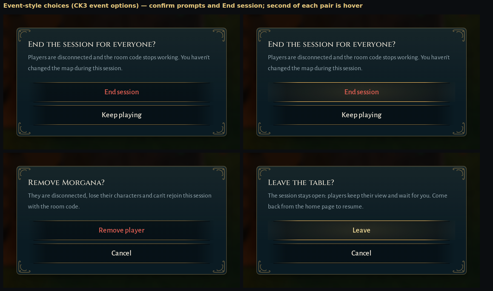
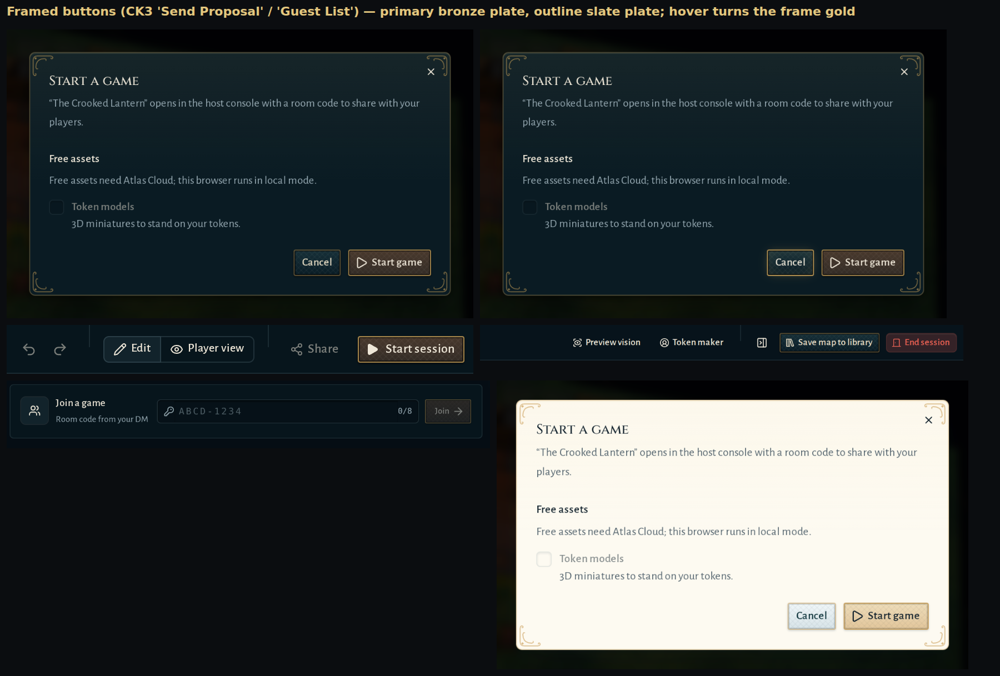

# "Gilded" theme proposal

Before/after screenshots of the theme on branch `design/gilded-theme` (1600×900, dark theme unless noted).

## Buttons (after Crusader Kings III's event UI)

CK3 has two button families, both reproduced as `Button` variants:

- **Event options** (`variant="decision"`): full-width dark bands between two thin gold hairlines that fade out
  at both ends, centred text, no side borders; hover lights the band from the centre and brightens the lines.
  Used where Atlas asks the user to decide: `useConfirm()` prompts and the End session dialog.
- **Framed buttons** (`default`, `outline`): square plates with a faint woven texture, a bronze frame and a dark
  keyline inside it; the frame turns gold on hover. `default` (primary) is warmed to bronze like CK3's
  "Send Proposal"; `outline` stays slate like "Guest List" / "Replace".

| | |
| --- | --- |
| Event-style choices |  |
| Framed buttons |  |

## Screens

| Screen | |
| --- | --- |
| Home |  |
| Editor |  |
| Start-game dialog |  |
| DM host console |  |
| Player view |  |
| Token Maker |  |
| Library cards (after) |  |
| Light theme (after) |  |
